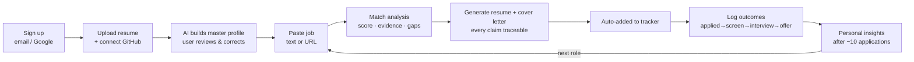

# MVP Scope

**Single-player only.** One senior full-stack engineer, ~3 months to
production quality. The MVP proves the full core loop end-to-end for one persona,
then stops.

## The MVP user journey (signup → success)

**Success moment:** the user walks into an interview with a resume they *trust*
and data showing what's working.

## Minimum feature set

| Area | Included |
|---|---|
| Auth | Email + Google OAuth; account settings; **data export/delete** |
| Profile | Resume upload → AI parse → editable master profile |
| Evidence | **GitHub OAuth import** (repos, languages, activity → evidence items) |
| Job capture | Paste text/URL; AI extracts title, company, skills, requirements |
| Match | Score + matched evidence + gap list, with rationale |
| Tailoring | Evidence-constrained resume + cover letter; export **PDF/DOCX** |
| Tracker | Kanban + list, status pipeline, notes, reminders |
| Outcomes | Outcome logging + a simple personal-insights view |

## Out of scope (this cycle)

See [What NOT to build](market-and-competition.md#what-not-to-build-initially).
Summary: recruiter side, portfolio verification, AI interview prep, auto-apply,
networking/social, LinkedIn integration, mobile apps.

## Success metrics

| Metric | Target |
|---|---|
| Time from signup to first tailored resume | < 15 min |
| Users completing the full core loop at least once | ≥ 70% |
| Fabrication rate in generated docs (unsupported claims) | ~0 (validator-enforced) |
| Transactional API p95 latency | < 300 ms (NFR-P1) |
| Incidents where an LLM outage broke CRUD | 0 (NFR-R1) |

## Sequencing

Platform → profile+GitHub → jobs+match → tailoring → tracking → outcomes/insights.
See the [Roadmap](roadmap.md) and
[Implementation Progress](../08-engineering/implementation-progress.md).

## Related

- [Requirements](requirements.md) · [User Stories](user-stories.md) · [Roadmap](roadmap.md)
