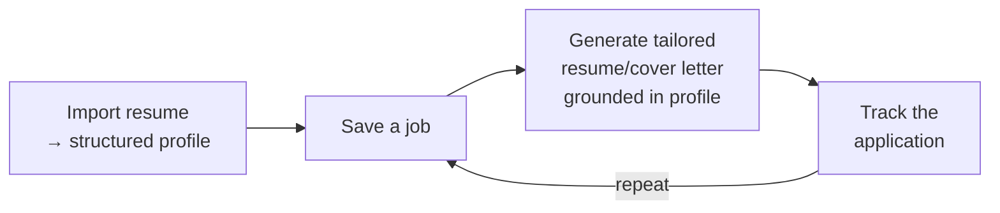

# MVP Scope

The MVP proves the core loop end-to-end for one persona, then stops. Anything
that doesn't serve the thin vertical slice is explicitly out.

## The core loop (the thing we must prove)

If a user can walk this loop and trust the output, the MVP has delivered its
central hypothesis: *grounded AI tailoring on top of a reliable transactional
core is worth using.*

## In scope

| Area | Included |
|---|---|
| Auth | Account + login (password; OAuth if cheap) |
| Profile | Manual profile CRUD **and** resume upload → parse |
| Jobs | Save a job with description/URL |
| AI | One grounded generation flow (tailored resume) via RAG |
| Tracking | Application status lifecycle + pipeline list view |
| Platform | Deny-by-default security, health probes, CI, migrations |

## Out of scope (this cycle)

- Job aggregation/scraping or a job board.
- Multi-user, teams, sharing.
- Auto-apply / bulk submission.
- Cover-letter generation *may* slip to fast-follow if resume flow runs long.
- Analytics dashboards, notifications, email.
- Mobile app (web is responsive; no native).

## Success metrics

The MVP is validated if, for a small set of real users:

| Metric | Target |
|---|---|
| Time from signup to first tailored resume | < 15 min |
| Users who complete the full core loop at least once | ≥ 70% |
| Perceived groundedness ("did it reflect my real experience?") | ≥ 4/5 |
| Transactional API p95 latency | < 300 ms (NFR-P1) |
| Zero incidents where an LLM outage broke CRUD | 0 (NFR-R1) |

## Sequencing

Build order follows dependency, not feature glamour: platform → profile → jobs →
AI → tracking. See the [Roadmap](roadmap.md) and
[Implementation Progress](../08-engineering/implementation-progress.md).

## Related

- [Requirements](requirements.md) · [User Stories](user-stories.md) · [Roadmap](roadmap.md)
