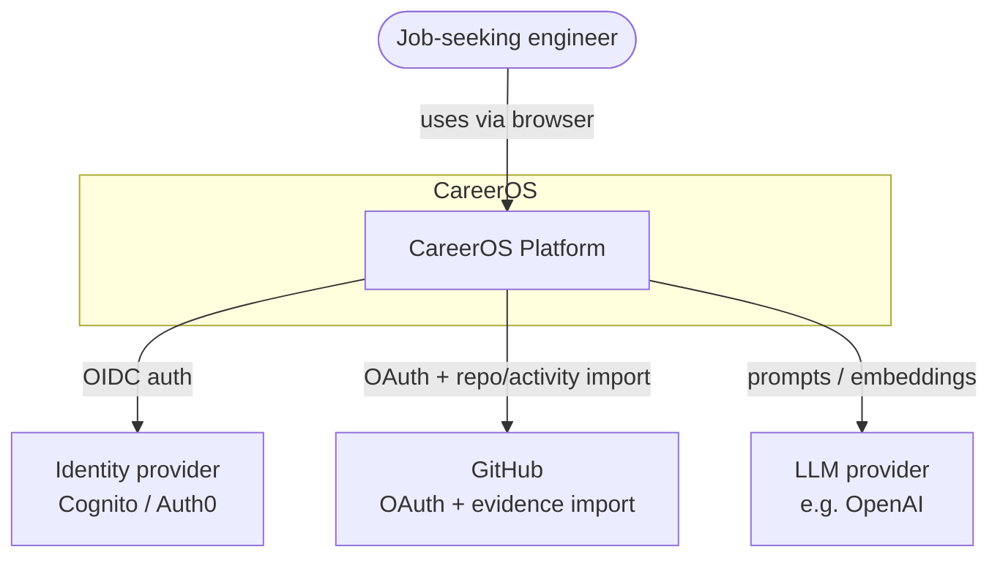
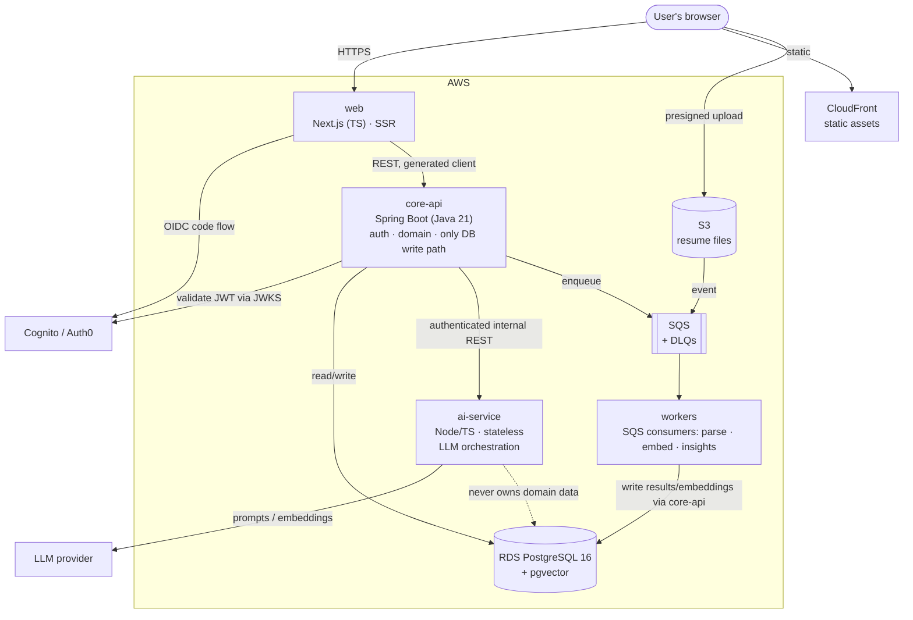
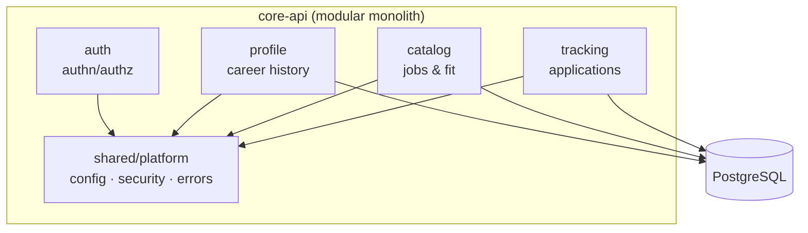

# Architecture Overview

This is the 30,000-foot view of CareerOS, structured with the
[C4 model](https://c4model.com): Context (L1) → Containers (L2) → Components (L3).
Deeper detail lives in [Backend](../02-backend/overview.md),
[Frontend](../03-frontend/overview.md), [AI](../04-ai/overview.md), and
[Data](../05-data/schema.md).

The foundational structural decision — a **modular monolith plus one AI
service**, not microservices — is recorded in
[ADR-001](../07-decisions/README.md) and is the single most important thing to
understand about this system.

## Architectural drivers

The shape of the system follows from a few forces (see [requirements](../00-product/requirements.md)):

- **One engineer builds and operates it.** Minimize moving parts.
- **Two workload shapes.** Transactional CRUD (predictable, low-latency) vs. AI
  orchestration (I/O-bound, bursty, streaming, fails in LLM-specific ways).
- **AI failures must not sink the core** (NFR-R1).
- **Grounded AI** requires vector retrieval close to the data.

## C4 Level 1 — System context

Who and what CareerOS talks to.

## C4 Level 2 — Containers

The deployable/runnable pieces and how they communicate. Target runtime is
**AWS** (ECS Fargate behind an ALB; managed data services). See
[infrastructure](../09-operations/infrastructure.md).

**Four moving parts to operate** (the max a solo engineer should carry): two
services, workers, one database. Everything is stateless on Fargate; queues
absorb AI burstiness and provide backpressure.

Key rules encoded here (from [ADR-001](../07-decisions/README.md)):

- **`core-api` is the only writer to the database.** `ai-service` is stateless
  and never owns domain data.
- **Nothing blocks on an LLM call.** Long AI work goes through the queue.
- **One datastore.** Postgres + pgvector; embeddings isolated in their own table
  so a future vector-DB swap is a migration, not a redesign.

## C4 Level 3 — core-api components

The internal modules of the monolith are the future extraction seams.

Module boundaries are enforced, not merely conventional — see
[Module Boundaries](../02-backend/module-boundaries.md).

## Primary runtime flow — grounded generation

The system's signature flow, tailored resume generation, is asynchronous and
streaming. The full sequence diagram lives in
[AI Overview](../04-ai/overview.md) and [RAG Pipeline](../04-ai/rag-pipeline.md).

At a glance: `web → core-api → (retrieve from pgvector) → ai-service → LLM
(stream) → web`, with heavy work (parsing, embedding) offloaded to the queue so
the request path stays fast.

## Cross-cutting concerns

| Concern | Where documented |
|---|---|
| Security (authn/authz, secrets, threat model) | [security.md](security.md) |
| Observability (logs, metrics, traces) | [observability.md](observability.md) |
| Principles & constraints | [principles-and-constraints.md](principles-and-constraints.md) |
| Technology choices | [tech-stack.md](tech-stack.md) |
| Deeper system design & scaling | [system-design.md](system-design.md) |

## Related

- [ADR-001 — Modular monolith + AI service](../07-decisions/README.md)
- [Data schema](../05-data/schema.md)
