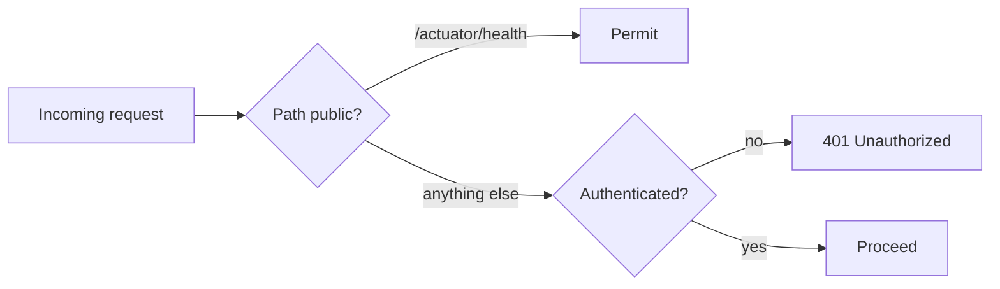

# Security Architecture

Covers authentication, authorization, secrets, and the threat model. Requirements
: NFR-S1–S4 in [Requirements](../00-product/requirements.md).

## Current posture (implemented)

**Deny-by-default.** `SecurityConfig` (`apps/core-api`) authorizes every request
by default; only `/actuator/health` is public. New endpoints are therefore secure
unless deliberately opened (US-E1).

- Stateless sessions (`SessionCreationPolicy.STATELESS`) — no server-side
  session state to forge.
- CSRF disabled *because* the API is stateless JSON with no browser session
  cookies; this is a deliberate, documented choice, not an oversight.

## Planned

- **Authentication:** OIDC resource server (JWT validation) — Milestone 0 tail.
  Supports password + OAuth (Google, GitHub) per FR-1.1/1.2.
- **Authorization:** per-user data isolation — a user can only access their own
  profiles, jobs, applications.
- **Service-to-service:** `core-api ↔ ai-service` over authenticated internal
  REST.

## Secrets management

- No secrets in git (NFR-S2). Local uses `docker-compose` defaults clearly marked
  "local only." Deployed envs inject via environment/secret store — see
  [deployment](../08-engineering/deployment.md).

## Threat model (to expand)

> **Status: draft.** Build out with STRIDE per entry point as endpoints land.

| Asset | Threat | Mitigation |
|---|---|---|
| User PII / career data | Unauthorized access | Deny-by-default, per-user authz, TLS |
| Resume uploads | Malicious file / injection | Validation, sandboxed parsing |
| LLM prompts | Prompt injection via job descriptions | Input sanitization, grounding, output checks |
| Secrets | Leak via logs/git | Secret store, log scrubbing |

## Related

- [Data lifecycle & PII](../05-data/data-lifecycle.md)
- [ADR-001](../07-decisions/README.md)
