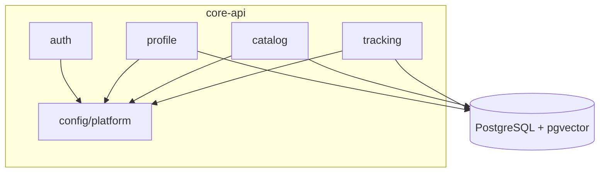

# Backend Overview — `core-api`

`core-api` is the Spring Boot (Java 21) modular monolith. It owns authentication,
all domain entities, and — critically — the **only write path to the database**.
See [ADR-001](../07-decisions/README.md) for why it's a monolith and not
microservices.

## Responsibilities

- Authentication & authorization (deny-by-default; see [security](../01-architecture/security.md)).
- All domain logic: profiles, jobs, applications.
- The sole owner of database writes; enforces invariants and migrations.
- Enqueuing async work (parsing, embedding) and exposing results.
- Serving the REST API + generating the [OpenAPI contract](../06-api/overview.md).

## Module map

Internal packages with **enforced boundaries** — these are the future
microservice extraction seams.

| Module | Responsibility | Status |
|---|---|---|
| `platform`/`config` | Cross-cutting: security, error handling, config | partial (SecurityConfig) |
| `auth` | Authentication, identity | planned |
| `profile` | Career history, resume data | planned |
| `catalog` | Jobs and fit assessment | planned |
| `tracking` | Application lifecycle | planned |



Boundary enforcement details: [Module Boundaries](module-boundaries.md).

## Current state (implemented)

- `CareerOsApplication` — Spring Boot entry point.
- `SecurityConfig` — deny-by-default, stateless, CSRF off (documented rationale).
- Flyway-managed schema; JPA `ddl-auto=validate` (ORM never mutates schema).
- Actuator health/readiness probes.
- Testcontainers integration test booting the full app against real pgvector.

## Package layout

```
com.careeros.api
├── CareerOsApplication.java      # entry point
├── config/                       # SecurityConfig, cross-cutting config
├── auth/          (planned)
├── profile/       (planned)
├── catalog/       (planned)
└── tracking/      (planned)
```

## Key conventions

- **Schema is owned by Flyway**, never Hibernate. See [migrations](../05-data/migrations.md).
- **`open-in-view: false`** — no lazy-loading across the view boundary; DTOs are
  explicit.
- **Deny-by-default** — new endpoints require authentication unless deliberately
  opened.
- Error handling & response shape: [error-handling](error-handling.md).
- Coding standards: [coding-standards](coding-standards.md).

## Related

- [Data schema](../05-data/schema.md) · [API](../06-api/overview.md) · [Testing](../08-engineering/testing-strategy.md)
