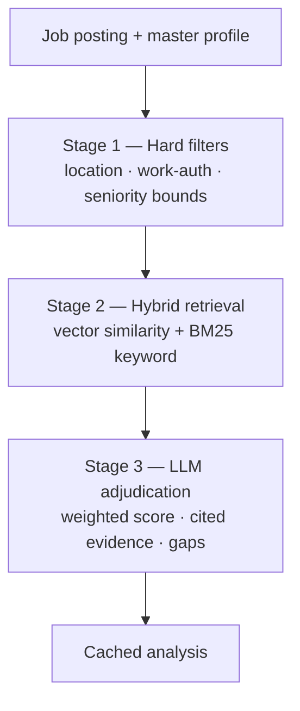

# Job Matching Algorithm

Match analysis produces a **score + matched evidence + gap list + emphasis
advice** (FR-3.2). It's a **three-stage** pipeline; each stage fixes the previous
one's weakness.

## Stages

1. **Hard filters** — location / work-authorization / seniority bounds. Cheap
   correctness; discard impossible matches first.
2. **Hybrid retrieval** — embedding similarity **+ BM25 keyword overlap** between
   requirement items and profile facts.
   - Vectors catch semantics: *"built REST services in Go"* ≈ *"backend API
     development."*
   - Keywords catch exact-tech requirements that vectors blur.
3. **LLM adjudication** — over the top-k evidence pairs, with **structured
   output**: weighted score (must-haves weighted heavily), cited evidence, and a
   gap list with severity + emphasis advice.

## Why hybrid (design rationale)

- **Not pure-LLM** ("score everything with one prompt"): cost, latency, and score
  instability.
- **Not pure-vector**: cosine similarity is *not* qualification — it can't weigh
  must-have vs. nice-to-have or reason about seniority.
- **Hybrid is more code, but each layer is testable**, and the eval harness holds
  score drift within **±5 on identical input** (NFR-P5).

## Caching & the data moat

Analyses are cached per **`(profile_version, posting_hash)`** (FR-3.3). Over time,
**outcome data tunes the stage weights** — the data moat becoming algorithm
([Market & Competition](../00-product/market-and-competition.md)).

## Related

- [RAG pipeline](rag-pipeline.md) · [AI overview](overview.md) · [Schema](../05-data/schema.md)
