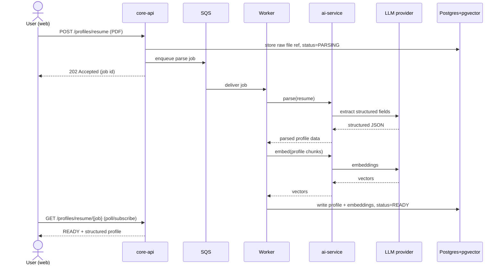

# AI / LLM Architecture Overview

The AI layer is what makes CareerOS more than a tracker. It's deliberately
isolated into a separate **`ai-service`** (Node/TypeScript, added ~Week 2) so its
latency and failure characteristics never touch the transactional core
([ADR-001](../07-decisions/README.md), NFR-R1).

## Design tenets

1. **Stateless.** `ai-service` owns no domain data and never writes to the DB
   directly. It receives context, calls the LLM, returns/streams output.
2. **Nothing blocks on an LLM call.** Heavy work (resume parsing, embedding
   generation) runs async via SQS + workers.
3. **Grounded.** Generation is anchored to the user's real data via retrieval
   (RAG), not free invention (FR-4.3).
4. **Isolated embeddings.** Vectors live in one pgvector table so a dedicated
   vector store later is a migration, not a redesign.

## Where AI shows up

| Capability | Sync/Async | Doc |
|---|---|---|
| Resume parsing (PDF → structured) | Async (queue) | this page, [pipeline](rag-pipeline.md) |
| Embedding generation | Async (queue) | [rag-pipeline](rag-pipeline.md) |
| Fit assessment (job ↔ profile) | Sync (retrieval) | [rag-pipeline](rag-pipeline.md) |
| Tailored resume / cover letter | Sync, streaming | this page |

## Flow 1 — Resume parsing (async, non-blocking)

Upload returns immediately; the heavy work happens off the request path.



## Flow 2 — Tailored generation (sync, streaming, grounded)

The signature flow. Retrieval grounds the prompt; tokens stream to the user.

```mermaid
sequenceDiagram
    actor U as User (web)
    participant API as core-api
    participant DB as Postgres+pgvector
    participant AI as ai-service
    participant LLM as LLM provider

    U->>API: POST /jobs/{id}/tailor (resume)
    API->>DB: fetch job + embed query
    API->>DB: pgvector similarity search (profile chunks)
    DB-->>API: top-k relevant experience
    API->>AI: generate(job, grounded context)
    AI->>LLM: prompt (streaming)
    loop stream
        LLM-->>AI: token
        AI-->>API: token
        API-->>U: token (SSE/stream)
    end
    Note over API,U: First token < 3s (NFR-P3);<br/>output traceable to retrieved chunks (FR-4.3)
```

## Failure handling

- LLM timeout/outage → surfaced as an upstream error
  ([error handling](../02-backend/error-handling.md)); the transactional core and
  all CRUD stay fully available (NFR-R1).
- Async jobs are retried with backoff; workers are idempotent (NFR-R2). Design
  detail in [system-design](../01-architecture/system-design.md).

## Related

- [RAG pipeline](rag-pipeline.md) · [Prompts & evals](prompts-and-evals.md) · [Model strategy](model-strategy.md)
- [ADR-001](../07-decisions/README.md)
