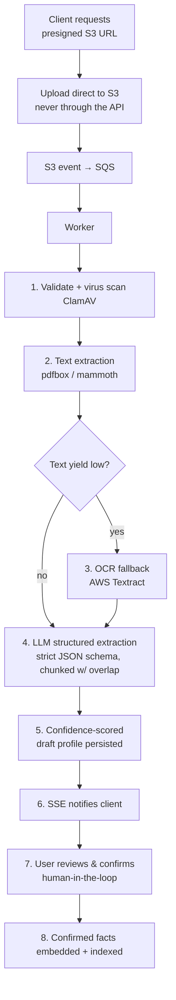

# Resume Processing Pipeline

How an uploaded resume becomes a structured, source-attributed master profile.
Every stage is **idempotent and separately retryable**; the original file is
retained in S3 (re-parsing improves as prompts improve — cheap goodwill later).

## Pipeline

## Stage notes

1. **Validate + virus scan** — ClamAV on every upload (NFR-S5).
2. **Text extraction** — `pdfbox` (PDF) / `mammoth` (DOCX).
3. **OCR fallback** — AWS Textract when text yield is low (scanned resumes).
4. **LLM structured extraction** — against a strict JSON schema; long documents
   chunked with overlap.
5. **Confidence-scored draft** — persisted for review.
6. **SSE** notifies the client of progress/completion (NFR-P4: < 60 s with
   feedback).
7. **Human-in-the-loop** review — a **product feature, not a compromise**; builds
   trust and correctness.
8. **Embed + index** — confirmed facts become source-attributed `evidence_items`
   and embeddings ([schema](../05-data/schema.md)).

## Reliability

Every stage idempotent and separately retryable; **DLQ + alert** on repeated
failure (NFR-R2). Upload goes **direct to S3 via presigned URL**, never through
the API.

## Related

- [AI overview](overview.md) · [RAG pipeline](rag-pipeline.md) · [Schema](../05-data/schema.md) · [Security](../01-architecture/security.md)
