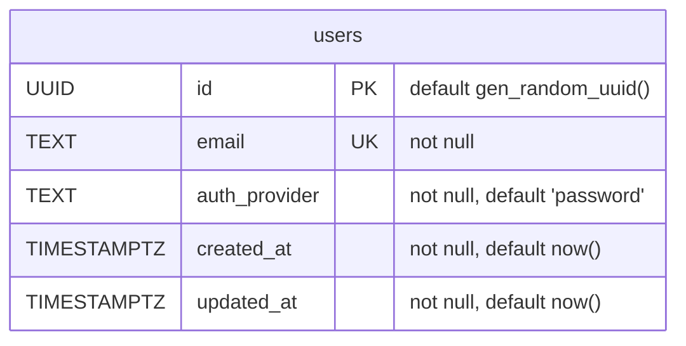
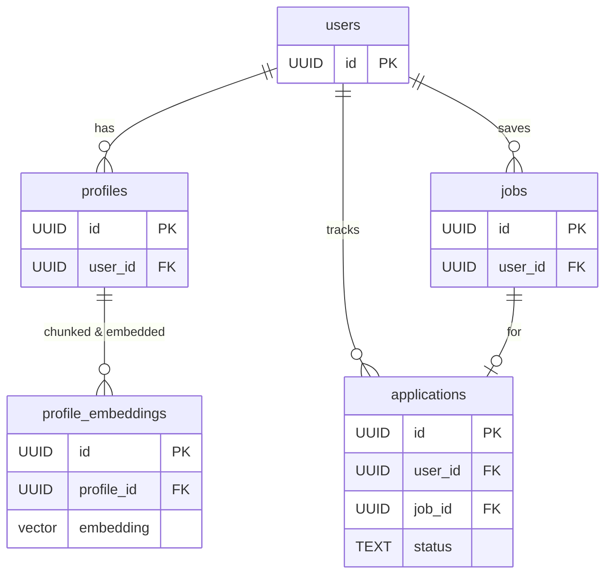

# Database Schema & ERD

Reference for the CareerOS data model. The **source of truth is the Flyway
migrations** in `apps/core-api/src/main/resources/db/migration/`; this page
explains and visualizes them. When they diverge, the migrations win — update this
page.

## Current schema (V1)

The foundation deliberately ships with only `users` — every future entity hangs
off it. The `vector` (pgvector) extension is enabled up front so later migrations
can add embedding columns/tables without an infrastructure change.

### `users`
| Column | Type | Notes |
|---|---|---|
| `id` | UUID | PK, `gen_random_uuid()` |
| `email` | TEXT | unique, not null; indexed (`idx_users_email`) |
| `auth_provider` | TEXT | `'password'` \| `'google'` \| `'github'`; default `'password'` |
| `created_at` | TIMESTAMPTZ | default `now()` |
| `updated_at` | TIMESTAMPTZ | default `now()` |

## Conventions

- **UUID primary keys** (`gen_random_uuid()`) — no sequential/guessable IDs.
- **`TIMESTAMPTZ`** for all timestamps (always timezone-aware).
- **`created_at` / `updated_at`** on every table.
- **pgvector** enabled from V1; embeddings will live in their **own isolated
  table** (see [data lifecycle](data-lifecycle.md) and
  [RAG pipeline](../04-ai/rag-pipeline.md)) so the vector store can be swapped
  later.

## Planned tables (target model)

As modules land ([backend](../02-backend/overview.md)), the model grows roughly:

> This is the **planned** direction, not yet migrated. Each table arrives via its
> own Flyway migration and this page is updated in the same PR.

## Related

- [Migrations](migrations.md) · [Data lifecycle & PII](data-lifecycle.md) · [Backend](../02-backend/overview.md)
