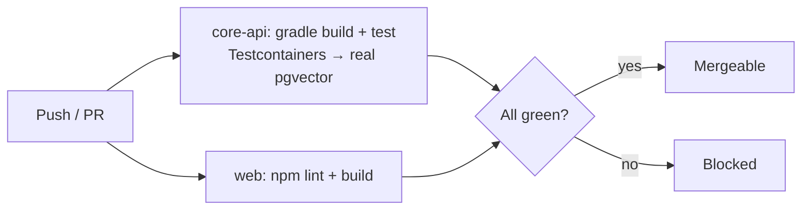

# Development Workflow

How code (and docs) get from idea to `main`.

## Local setup

Prereqs: **Java 21, Node 22+, Docker**.

```bash
# 1. Database (Postgres 16 + pgvector)
docker compose up -d

# 2. core-api
cd apps/core-api
gradle wrapper --gradle-version 8.10   # first time only; wrapper is committed after
./gradlew bootRun                       # http://localhost:8080/actuator/health

# 3. web
cd apps/web
npm install
npm run dev                             # http://localhost:3000
```

## Branching & pull requests

- Work on a branch; open a PR into `main`.
- **CI must be green before merge** (NFR-M3) — see [CI](#continuous-integration).
- Keep PRs small and focused; one logical change.

### PR checklist
- [ ] Tests added/updated and passing.
- [ ] **Docs updated (or N/A)** — the doc that describes the changed behavior.
- [ ] Schema change? → new Flyway migration + [schema.md](../05-data/schema.md) updated.
- [ ] Significant decision? → an [ADR](../07-decisions/README.md).
- [ ] No secrets committed.

## Docs-as-code

Documentation ships in the **same PR** as the code it describes. See
[Documentation Conventions](../CONVENTIONS.md). This is what keeps the knowledge
base a *living* document instead of an archaeology project.

## Continuous integration

`.github/workflows/ci.yml` runs on every push to `main` and every PR:



- **core-api:** `gradle build` (compiles + runs Testcontainers integration tests
  against real pgvector).
- **web:** `npm run lint` + `npm run build`.

## Key conventions (cross-reference)

| Convention | Where |
|---|---|
| Schema changes = Flyway migrations | [migrations](../05-data/migrations.md) |
| Significant decisions = ADRs | [decisions](../07-decisions/README.md) |
| Deny-by-default security | [security](../01-architecture/security.md) |
| Generated API contract | [API](../06-api/overview.md) |
| Testing approach | [testing strategy](testing-strategy.md) |

## Related

- [Implementation progress](implementation-progress.md) · [Deployment](deployment.md)
