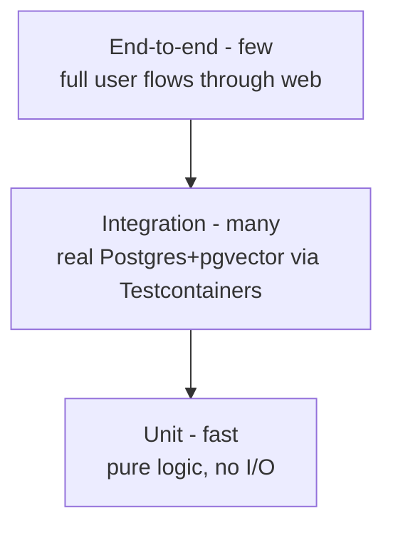

# Testing Strategy

Tests exist to let one engineer refactor and ship fast without fear. The bias is
toward **high-fidelity integration tests** over heavy mocking.

## Test pyramid

## Backend (`core-api`)

- **Integration tests use Testcontainers** against the **same**
  `pgvector/pgvector:pg16` image as production, with **real Flyway migrations**
  applied. No mocking the database.
- Current example — `HealthEndpointTest` boots the full app and verifies:
  1. the app starts with a valid schema (migrations run),
  2. `/actuator/health` is publicly reachable,
  3. every other route is denied by default (security posture is tested, not
     assumed).
- Run: `cd apps/core-api && ./gradlew test` (needs Docker).

## Frontend (`web`)

- Currently: `npm run lint` + `npm run build` gate every PR.
- To add: component tests and, for the core loop, an end-to-end test (e.g.
  Playwright).

## AI (`ai-service`, planned)

- **Prompt/eval regression tests** — a golden set run in CI when prompts/models
  change; assert groundedness and format validity. See
  [prompts & evals](../04-ai/prompts-and-evals.md).
- Contract tests for the `core-api ↔ ai-service` boundary.

## What we deliberately test

- **Security posture** — deny-by-default is asserted, so a misconfigured endpoint
  fails CI.
- **Migrations** — a broken migration fails the integration tests.
- **The contract** — (planned) CI fails if the generated client drifts from the
  OpenAPI spec.

## CI gate

All of the above run in [CI](development-workflow.md#continuous-integration) and
must be green before merge (NFR-M3).

## To define

- Coverage expectations (target, and where coverage matters vs. not).
- Test data / fixtures strategy.
- E2E tooling choice.

## Related

- [Development workflow](development-workflow.md) · [Migrations](../05-data/migrations.md)
