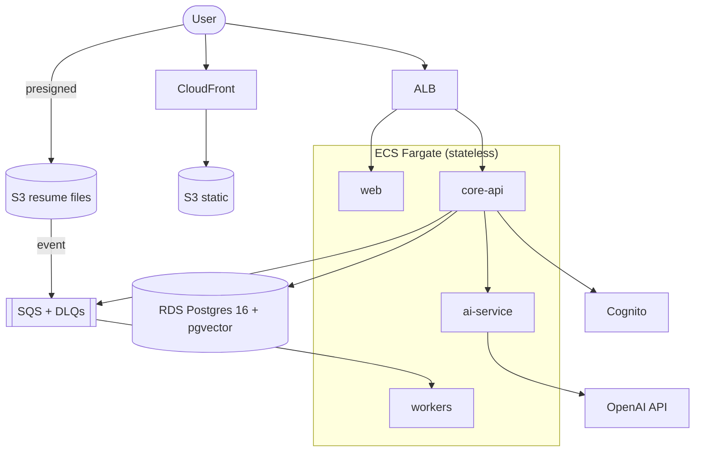

# Infrastructure

Target topology is **AWS**, chosen so a solo engineer operates the fewest moving
parts. Requirement: run within a solo-project budget (NFR-C2).

## Local (implemented)

- `docker-compose.yml` runs Postgres 16 + pgvector locally with a healthcheck and
  a persistent volume (`pgdata`). Local credentials are clearly marked "local
  only — never reuse in deployed envs."

## Deployed topology (planned)

### Components
| Component | Service | Notes |
|---|---|---|
| Compute | ECS Fargate + ALB | Everything **stateless**; scaling is configuration |
| Database | RDS PostgreSQL 16 + pgvector | Single instance; indexes + read replica for headroom |
| Queue | SQS + DLQs | Absorbs AI burstiness; DLQ alerting from day one |
| File storage | S3 | Presigned direct uploads; original files retained |
| CDN | CloudFront | Static assets |
| Auth | Cognito (or Auth0) | OIDC; see [ADR-002](../adr/002-managed-auth.md) |
| OCR | Textract | Resume OCR fallback |
| Secrets / crypto | Secrets Manager + KMS | Encryption at rest; least-privilege IAM |

## Scaling posture

- **Design for 10×, build for 1×.** Stateless services scale horizontally; queues
  give backpressure for free; the DB has years of headroom.
- **First realistic bottleneck:** LLM rate limits and cost — mitigate with caching
  (match analyses are cacheable by construction), model routing, and quotas.
- **Second:** worker throughput at resume-import spikes — mitigate with
  queue-depth autoscaling.

## Deliberate non-goals at MVP

No Kubernetes, no multi-region, no event sourcing, no dedicated vector DB, no
service mesh. Each has a written **trigger metric** before it's revisited (e.g.
pgvector p95 retrieval > 200 ms sustained, or > 1M embedding rows —
[ADR-001](../07-decisions/README.md)). *Every piece of infrastructure you add is a
thing that pages you.*

## Related

- [Deployment](../08-engineering/deployment.md) · [Runbook](runbook.md) · [Tech stack](../01-architecture/tech-stack.md)
